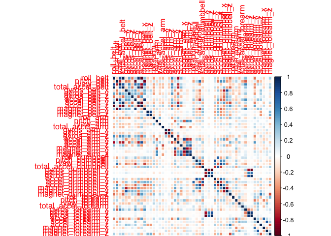
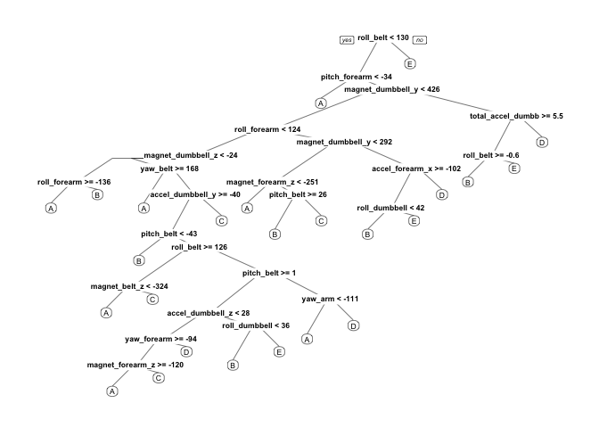

Synopsis
--------

Human Activity Recognition (**HAR**) has emerged as a key research area
in the last years. Through devices such as Jawbone Up, Nike FuelBand,
and Fitbit, we can have access to a large amount of data about personal
activity relatively inexpensively.

In this project, we have used data from accelerometers on the belt,
forearm, arm, and dumbell of 6 participants to predict the manner in
which they did the exercise of lifting barbell(correctly (refered as
Class A) or incorrectly (other Classes: B, C, D and E)). We were able to
build a predictive algorithm with more than 99% of accuracy and less
than 1% of estimated out-of-sample errors.

The comptutations were conducted on Rstudio 0.98.1091 with Knitr on Mac
OS Mavericks 10.9.5. Our methodology, performance metrics and prediction
results are presented below.

R packages
----------

Our R code uses the following packages:

    library(caret)
    library(rpart)
    library(rpart.plot)
    library(randomForest)
    library(corrplot)

Please note that the packages must have been installed previously (if
not it can be easily done through the "install.packages("name of the
package")" function)

Data source
-----------

More information regarding the data set is given at the web page
mentioned below (see also the reference following the appendix):

<http://groupware.les.inf.puc-rio.br/har>

(see the section on the Weight Lifting Exercise Dataset)

Let's download the data:

    train_Url <-"https://d396qusza40orc.cloudfront.net/predmachlearn/pml-training.csv"
    test_Url <- "https://d396qusza40orc.cloudfront.net/predmachlearn/pml-testing.csv"
    train_File <- "./data/pml-training.csv"
    test_File  <- "./data/pml-testing.csv"
    if (!file.exists("./data")) {
      dir.create("./data")
    }
    if (!file.exists(train_File)) {
      download.file(train_Url, destfile=train_File, method="curl")
    }
    if (!file.exists(test_File)) {
      download.file(test_Url, destfile=test_File, method="curl")
    }

Reading and cleaning the Data
-----------------------------

We can now read the two csv files into two data frames.  
Let's have a first look at the raw data:

    train_Raw <- read.csv("./data/pml-training.csv")
    test_Raw <- read.csv("./data/pml-testing.csv")
    dim(train_Raw)

    ## [1] 19622   160

    dim(test_Raw)

    ## [1]  20 160

The training data set is based on 19622 observations of 160 variables,
while the testing data set contains 20 observations and 160 variables.

**The outcome to predict is the "classe" variable in the training set**.

### From raw data to a tidy data set

The first step is to get rid of observations with missing values as well
as some meaningless variables.

    sum(complete.cases(train_Raw))

    ## [1] 406

The code below allows to remove columns that contain NA (missing
values).

    train_Raw <- train_Raw[, colSums(is.na(train_Raw)) == 0] 
    test_Raw <- test_Raw[, colSums(is.na(test_Raw)) == 0] 

Then, we get rid of some columns that do not contribute much to the
accelerometer measurements.

    classe <- train_Raw$classe
    train_Remove <- grepl("^X|timestamp|window", names(train_Raw))
    train_Raw <- train_Raw[, !train_Remove]
    train_Cleaned <- train_Raw[, sapply(train_Raw, is.numeric)]
    train_Cleaned$classe <- classe
    test_Remove <- grepl("^X|timestamp|window", names(test_Raw))
    test_Raw <- test_Raw[, !test_Remove]
    test_Cleaned <- test_Raw[, sapply(test_Raw, is.numeric)]

Now, the cleaned training data set contains 19622 observations and 53
variables, while the testing data set contains 20 observations and 53
variables. The "classe" variable is still in the cleaned training set.

### Training and testing data set

We have sliced the data into **a pure training data set (70%) and a
validation data set (30%)**. We have also used the validation data set
to conduct cross validation.

Please note that we set the seed for reproducibility.

    set.seed(10000) 
    inTrain <- createDataPartition(train_Cleaned$classe, p=0.70, list=F)
    train_Data <- train_Cleaned[inTrain, ]
    test_Data <- train_Cleaned[-inTrain, ]

The predictive model
--------------------

Our analysis uses a **Random Forest** (rf) algorithm which selects
important variables and is also robust to correlated covariates &
outliers. The correlation matrix can be observed in appendix (figure 1).

In addition, we have used a **5-fold cross validation** (cv).

    control_rf <- trainControl(method="cv", 5)
    model_rf <- train(classe ~ ., data=train_Data, method="rf", trControl=control_rf, ntree=250)
    model_rf

    ## Random Forest 
    ## 
    ## 13737 samples
    ##    52 predictor
    ##     5 classes: 'A', 'B', 'C', 'D', 'E' 
    ## 
    ## No pre-processing
    ## Resampling: Cross-Validated (5 fold) 
    ## 
    ## Summary of sample sizes: 10988, 10990, 10990, 10989, 10991 
    ## 
    ## Resampling results across tuning parameters:
    ## 
    ##   mtry  Accuracy   Kappa      Accuracy SD  Kappa SD   
    ##    2    0.9890085  0.9860936  0.002587214  0.003273412
    ##   27    0.9892991  0.9864617  0.001866259  0.002362085
    ##   52    0.9816546  0.9767898  0.005345402  0.006764313
    ## 
    ## Accuracy was used to select the optimal model using  the largest value.
    ## The final value used for the model was mtry = 27.

Performance metrics
-------------------

We have estimated the performance of the model on the **validation data
set**.

    predict_rf <- predict(model_rf, test_Data)
    confusionMatrix(test_Data$classe, predict_rf)

    ## Confusion Matrix and Statistics
    ## 
    ##           Reference
    ## Prediction    A    B    C    D    E
    ##          A 1673    1    0    0    0
    ##          B    5 1130    4    0    0
    ##          C    0    5 1020    1    0
    ##          D    0    0   12  950    2
    ##          E    0    1    2    2 1077
    ## 
    ## Overall Statistics
    ##                                           
    ##                Accuracy : 0.9941          
    ##                  95% CI : (0.9917, 0.9959)
    ##     No Information Rate : 0.2851          
    ##     P-Value [Acc > NIR] : < 2.2e-16       
    ##                                           
    ##                   Kappa : 0.9925          
    ##  Mcnemar's Test P-Value : NA              
    ## 
    ## Statistics by Class:
    ## 
    ##                      Class: A Class: B Class: C Class: D Class: E
    ## Sensitivity            0.9970   0.9938   0.9827   0.9969   0.9981
    ## Specificity            0.9998   0.9981   0.9988   0.9972   0.9990
    ## Pos Pred Value         0.9994   0.9921   0.9942   0.9855   0.9954
    ## Neg Pred Value         0.9988   0.9985   0.9963   0.9994   0.9996
    ## Prevalence             0.2851   0.1932   0.1764   0.1619   0.1833
    ## Detection Rate         0.2843   0.1920   0.1733   0.1614   0.1830
    ## Detection Prevalence   0.2845   0.1935   0.1743   0.1638   0.1839
    ## Balanced Accuracy      0.9984   0.9960   0.9907   0.9970   0.9986

    accuracy <- postResample(predict_rf, test_Data$classe)
    accuracy

    ##  Accuracy     Kappa 
    ## 0.9940527 0.9924766

    outsample_errors <- 1 - as.numeric(confusionMatrix(test_Data$classe, predict_rf)$overall[1])
    outsample_errors

    ## [1] 0.005947324

We see that the estimated accuracy of the model is 99.30% and the
estimated out-of-sample error is 0.70%.

Prediction results
------------------

The final steps consits in applying the model to the original testing
data set after removing the "problem\_id" column.

The results are easy to read in the **decison tree figure**(Appendix 2)

    result <- predict(model_rf, test_Cleaned[, -length(names(test_Cleaned))])
    result

    ##  [1] B A B A A E D B A A B C B A E E A B B B
    ## Levels: A B C D E

Appendix
--------

### Figure 1. Correlation Matrix

    corr_Plot <- cor(train_Data[, -length(names(train_Data))])
    corrplot(corr_Plot, method="color")

### Figure 2. Decision Tree

    tree_Model <- rpart(classe ~ ., data=train_Data, method="class")
    prp(tree_Model) 

Reference
---------

Velloso, E.; Bulling, A.; Gellersen, H.; Ugulino, W.; Fuks, H.
Qualitative Activity Recognition of Weight Lifting Exercises.
Proceedings of 4th International Conference in Cooperation with SIGCHI
(Augmented Human '13) . Stuttgart, Germany: ACM SIGCHI, 2013.
